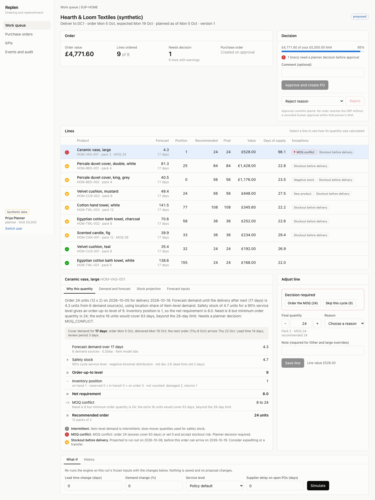

# Replen

Ordering and replenishment platform for a large omnichannel department-store retailer: design documents plus a working vertical slice. Everything runs on synthetic data; no figure, supplier or system here describes a real retailer.

The slice imports a legacy-style extract, forecasts demand per SKU, location, channel and day, recommends purchase orders with a step-by-step explanation, lets a planner override and approve within an approval limit, creates the purchase order through a mock ERP, and records events, audit history and KPIs.



## Quick start

Needs Node 22.12+ and [uv](https://docs.astral.sh/uv/). No Docker.

```bash
npm run setup     # dependencies, synthetic data, analytical store
npm run dev       # http://localhost:3000, sign in as planner.priya
npm test          # engine, API and mock ERP suites
npx playwright install chromium && npm run e2e   # full stack plus browser tests
```

## Layout

| Path | What |
|---|---|
| `docs/` | Deliverables A to J: competitive analysis, requirements, contexts, architecture, data model, maths, UX, build vs buy, migration, milestones, slice report |
| `contracts/` | OpenAPI for the planner API, JSON Schemas for events and the engine request/response |
| `engine/` | Python: forecasting, (R, S) policy, OR-Tools order optimiser, synthetic data generator, FastAPI service, DuckDB store |
| `apps/api/` | NestJS modular monolith: reference, inventory, planning, purchasing, audit, messaging, identity, KPIs |
| `apps/web/` | Next.js planner workbench with a backend-for-frontend proxy |
| `apps/mock-erp/` | Simulated ERP purchase-order API |
| `packages/contracts/` | TypeScript types generated from `contracts/` |
| `scripts/` | `dev.mjs` and `e2e.mjs` stack orchestration |

Start with [docs/README.md](docs/README.md), then [docs/11-vertical-slice.md](docs/11-vertical-slice.md) for what is real, what is simulated, benchmarks and gaps.
