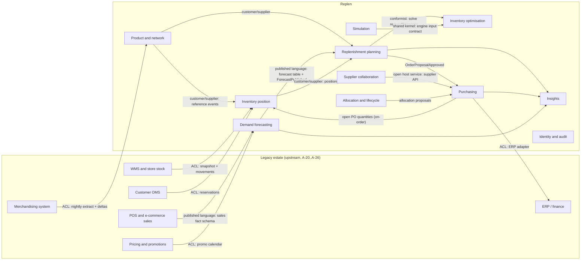

# C. Bounded contexts and context map

A bounded context here is a model boundary with one owner for its data and language. It is not a deployment unit. The deployment mapping is in [04-architecture.md](04-architecture.md).

## Contexts

| Context | Type | Owns (system of record inside Replen) | Does not own | Implemented in slice |
|---|---|---|---|---|
| Product and network | Supporting | Replica of products, attributes, hierarchy, locations, suppliers, sourcing rules, ranging, Replen-specific planning parameters (service level, capacity overrides) | Master data itself (legacy merchandising system is the source, A-20) | Yes, import API |
| Inventory position | Supporting | The calculated position per SKU-location: on-hand, reserved, in-transit, on-order, damaged, returns-pending, available-to-sell, inventory position | Physical stock records (WMS, store systems, A-21), customer reservations (OMS, A-25) | Yes, snapshot import and position calculation |
| Demand forecasting | Core | Cleaned demand history, features, forecast versions, backtest accuracy | Raw sales (POS/e-commerce feeds, A-22) | Yes, in engine |
| Replenishment planning | Core | Planning runs, order proposals, proposal lines, calculation traces, overrides, approvals | Purchase orders after creation | Yes |
| Inventory optimisation | Core (computation) | Policy parameters, solver models. Stateless: every result is returned to the caller that owns it | Any persisted state | Yes, in engine |
| Purchasing | Supporting | Purchase orders and transfer orders from creation to closure inside Replen; ERP submission state | The ERP's legal PO record (ERP is system of record once acknowledged) | POs only, mock ERP |
| Supplier collaboration | Supporting | Supplier confirmations, date/quantity counter-proposals, supplier-facing exceptions | Supplier contracts and terms (merchandising/ERP) | No (M3) |
| Allocation and lifecycle | Core | Initial allocations, launch and end-of-life plans, markdown hand-off signals | Price decisions (pricing system) | End-of-life truncation only |
| Simulation | Core | Scenarios (overlays on inputs) and their results | Live plans | Basic what-if endpoint, not persisted |
| Insights | Generic | KPI definitions and materialised KPI snapshots, assistant conversation logs | Source facts (read from other contexts' published data) | KPI API |
| Identity and audit | Generic | Users, roles, approval limits, append-only audit log | Corporate identity (workforce IdP) | Yes, dev tokens |

## Context map

Relationship notes:

- Every arrow from the legacy estate passes through an anti-corruption layer (ACL). Legacy codes, units and statuses are translated at the boundary and never appear in core models. This is what makes coexistence and later replacement of a legacy system possible (doc 09).
- Replenishment planning conforms to the inventory optimisation contract (`PlanRequest`/`PlanResponse` in `contracts/`). The contract is versioned; the engine supports the current and previous major version during rollout.
- Simulation shares the engine input contract with replenishment planning on purpose: a what-if runs the same code path as the live plan with overlays applied, so simulated and live results are comparable.
- Inventory position reads open Replen PO quantities through the purchasing module's query interface, combined with the legacy open-order extract. If purchasing is ever split into its own service, this becomes a projection fed by `purchase-order.*` events.

## Ubiquitous language

The full glossary is in [02-product-requirements.md](02-product-requirements.md#glossary). Terms that cross context boundaries and therefore need one meaning everywhere:

| Term | Meaning |
|---|---|
| SKU-location | A SKU at one stocking location (store or DC). The unit of inventory position and replenishment. |
| Series | A SKU x location x channel demand history or forecast. Store channel lives at stores, online channel at the fulfilling DC. |
| Inventory position (IP) | Sellable on-hand (floored at 0) minus reserved, plus in-transit, plus counted on-order. Excludes damaged and returns-pending. |
| Order proposal | A suggested order for one supplier, one destination and one order date, with one line per SKU. The unit of planner approval. |
| Recommended quantity | What the engine computed after constraints. Immutable once the proposal is created. |
| Final quantity | What the planner approved. Equal to recommended unless overridden with a reason code. |
| Calculation trace | The ordered list of steps, inputs and constraint applications that produced a recommended quantity. Stored with the line. |
