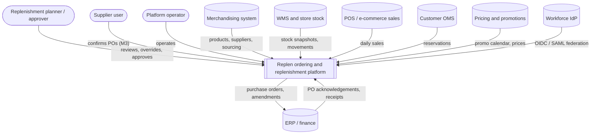
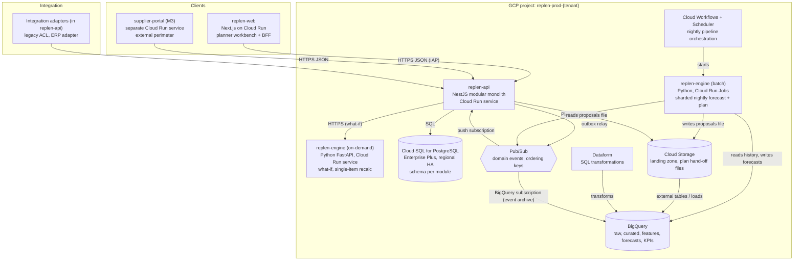
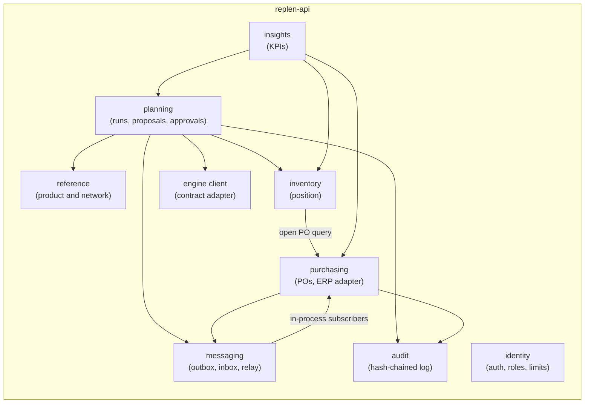
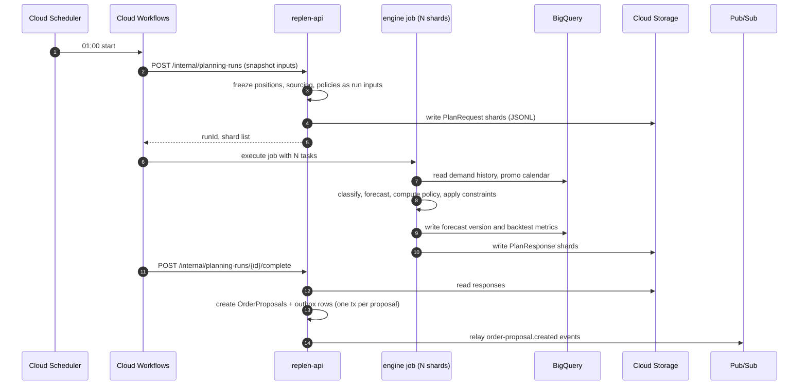
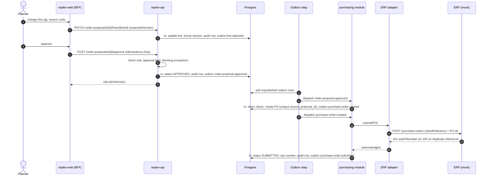
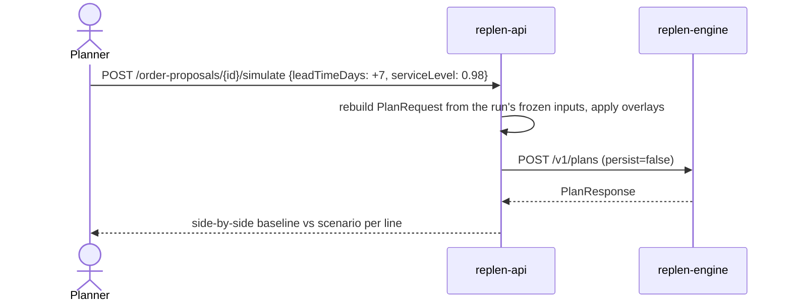

# D. Target architecture

Opinionated GCP architecture for Replen. Sizing figures refer to the assumption register ([assumptions.md](assumptions.md)); none are real retailer volumes.

## Principles

- Modular monolith for transactional work. Split a module into its own service only when one of these is true: a different security perimeter (internet-facing supplier portal), a different scaling profile that the monolith cannot absorb, or a team boundary that makes shared releases a bottleneck.
- Python only where the numerical libraries are (forecasting, optimisation). Python never owns workflow state.
- Contracts first: OpenAPI for synchronous APIs, JSON Schema for events and for the engine request/response. Code is checked against contracts in tests.
- Every financial commitment (PO creation, amendment, cancellation) requires a recorded human approval or a standing approval rule that a human created and that is itself audited. The assistant never holds write tools.
- Batch where the business is batch (nightly planning), event-driven where state changes need to propagate (approvals, PO status, stock movements).

## C4 level 1: system context

## C4 level 2: containers

In the local vertical slice the batch path is collapsed: `replen-api` calls the engine's `/v1/plans` endpoint synchronously, DuckDB stands in for BigQuery, PGlite or a local Postgres stands in for Cloud SQL, and the outbox relay writes to a local event log instead of Pub/Sub. The contracts are the same; only adapters differ.

## C4 level 3: replen-api modules

Module rules, enforced by code review and a lint rule in M1:

- Each module owns a Postgres schema (`reference`, `inventory`, `planning`, `purchasing`, `audit`, `messaging`, `identity`). Only the owning module writes to it.
- A module reads another module's data through that module's exported service, not by joining its tables. KPI queries are the one documented exception: read-only SQL views owned by `insights`.
- Cross-module state changes go through domain events in the outbox, even in-process. This keeps the split-out path open without a rewrite.

## Technology decisions and challenges

| Area | Requested | Challenge considered | Decision | Revisit when |
|---|---|---|---|---|
| Transactional services | TypeScript / NestJS | Go or Kotlin for raw throughput; plain Fastify for less abstraction | NestJS. Planner traffic is low (A-09) and batch ingestion is I/O bound. Module and DI system maps to the modular monolith; one language with the UI. NestJS 12 is ESM-only; compile with SWC for decorator metadata. | API p95 CPU-bound above 300 ms at target load |
| Service count | Microservices implied | One service per bounded context | Three deployables: `replen-api`, `replen-engine`, `replen-web`. Supplier portal added as a fourth in M3 for its external perimeter. Seven contexts share one API process and one database. | A module needs independent scaling or a separate team cadence |
| Forecasting/optimisation | Python | BigQuery ML `ARIMA_PLUS` with zero infrastructure; Vertex AI forecasting | Python engine owns models, because intermittent demand, censored history, analogue forecasting and calculation traces need code-level control. `ARIMA_PLUS` is kept as a challenger benchmark in the evaluation harness (doc 06). | A managed model beats the engine on WAPE and bias for two consecutive quarters |
| Transactional store | PostgreSQL | AlloyDB for heavier analytical reads; Spanner for horizontal scale | Cloud SQL for PostgreSQL Enterprise Plus, regional HA. Write volume (A-10, A-11) is far below single-primary limits. Spanner adds cost and Postgres-dialect gaps with no benefit for one region. | Proposal tables exceed about 2 TB or read replicas cannot hold planner query latency |
| Analytics | BigQuery | Keeping history in Postgres | BigQuery for sales history, features, forecasts (about 300 million forecast rows per night from A-06 x A-07) and KPI facts. Postgres holds only decision-relevant rows (proposals, POs). | n/a |
| Events | Pub/Sub | Managed Kafka for log replay; Eventarc | Pub/Sub with ordering keys per aggregate, dead-letter topics, and a BigQuery subscription that archives every event. Replay comes from the archive plus the transactional outbox, so Kafka's retention model is not needed. | Consumers need multi-day ordered replay at high volume |
| Orchestration | Not specified | Cloud Composer (Airflow) | Cloud Workflows + Cloud Scheduler. The nightly pipeline is a short DAG (ingest, transform, forecast shards, plan shards, hand-off); Composer's always-on cost and operations are not justified. | More than about 20 interdependent pipelines |
| Optimisation | OR-Tools | Solver for every SKU | Closed-form periodic-review policy per SKU-location. CP-SAT only where constraints couple lines: order budget, supplier minimum order value, vehicle capacity. This keeps 99% of lines explainable as arithmetic. | Coupled constraints become the norm (for example shared DC capacity) |
| UI | React / Next.js | Vite SPA, since the app is internal and SSR adds little | Next.js App Router, deployed as a standalone container on Cloud Run behind IAP. Server-side route handlers act as a backend-for-frontend so access tokens stay in httpOnly cookies. | Next.js upgrade cost outweighs BFF value |
| Local dev | Not specified | Docker Compose for everything | Docker Compose provided, but tests do not require Docker: PGlite (Postgres compiled to WASM) for API integration tests, DuckDB as the BigQuery stand-in. Tests run on a laptop or CI runner with Node and uv only. | PGlite diverges from Cloud SQL behaviour in a way tests depend on |

## Data ownership and consistency boundaries

| Aggregate | Owner | Consistency | Notes |
|---|---|---|---|
| PlanningRun | planning | Strong within the run record | Records engine version, contract version, data cut-off, input hashes |
| OrderProposal (+ lines) | planning | Strong. One transaction per command; optimistic concurrency via `version` | Lines are inside the aggregate because order-level constraints (budget, minimum order value) span lines |
| PurchaseOrder (+ lines) | purchasing | Strong inside the aggregate; eventual with planning | Created by reacting to `order-proposal.approved`. A unique constraint on `source_proposal_id` makes creation idempotent |
| InventoryPosition | inventory | Eventual with source systems; snapshot-consistent per import batch | On-order is derived from purchasing events |
| Forecast | forecasting (engine, BigQuery) | Immutable per forecast version | Proposals reference forecast version and keep a chart snapshot for audit |
| AuditEvent | audit | Append-only, hash-chained, written in the same transaction as the change it records | |

Cross-aggregate rule: one aggregate per transaction, plus outbox rows and audit rows in the same transaction. Effects on other aggregates happen through events.

## Events

Envelope: CloudEvents 1.0 structured JSON mode (`contracts/events/envelope.schema.json`) with extension attributes `correlationid`, `causationid`, `aggregateversion`, `tenantid`. Event `type` is `replen.<context>.<aggregate>.<verb>.v<major>`.

| Concern | Mechanism |
|---|---|
| Atomicity with state change | Transactional outbox in the `messaging` schema, written in the same transaction as the aggregate |
| Delivery | At-least-once. Relay publishes in outbox order; Pub/Sub ordering key = aggregate id |
| Ordering | Per aggregate only. Consumers compare `aggregateversion` with the last applied version and drop stale events |
| Idempotency (consumers) | Inbox table keyed by `(consumer, event id)` written in the consumer's transaction |
| Idempotency (commands) | `Idempotency-Key` header on mutating POSTs, stored with a request hash and the response for 24 hours; same key with a different body returns 422 |
| Idempotency (ERP) | PO id is sent as the ERP client reference; the adapter treats "duplicate reference" as success and reads back the ERP PO number |
| Schema evolution | Additive changes keep the major version. Breaking changes publish `v2` alongside `v1` until consumers migrate |
| Replay | Outbox rows are retained 30 days; BigQuery subscription keeps the full history; Pub/Sub seek for short windows |
| Poison messages | Dead-letter topic after 10 attempts, alert on DLQ depth > 0 |

## Security

- Identity: planners authenticate through the workforce IdP via Workforce Identity Federation and Identity-Aware Proxy (A-62). The API validates the IAP JWT. The slice uses HMAC-signed dev tokens, enabled only when `AUTH_MODE=dev`.
- Authorisation: role-based (viewer, planner, senior planner, head of replenishment, admin) plus per-user approval limits (A-46). Four-eyes: a user cannot approve a proposal they escalated, and any override above a value threshold needs a second person.
- Service identity: one service account per deployable with least-privilege IAM; no service account keys; Cloud Run to Cloud SQL via the Cloud SQL connector with IAM database auth.
- Data protection: VPC Service Controls perimeter around BigQuery, Cloud Storage and Cloud SQL; CMEK on all stores; Secret Manager for ERP credentials. Cost prices and supplier terms are classified commercially confidential. Sales feeds carry no customer identifiers (A-22), so the platform holds no customer personal data by design.
- Supplier portal (M3): separate Cloud Run service and identity pool (Identity Platform), row-level filtering by supplier id at the API, Cloud Armor WAF.
- Supply chain: dependency pinning with lockfiles, container image scanning with Artifact Analysis, Binary Authorization on Cloud Run.

## Tenancy and isolation

Silo model: one set of GCP projects per retailer tenant (A-61). A major retailer will ask for its own encryption keys, its own data residency, independent release windows and no shared blast radius; silo meets all four with the least application complexity. Application code carries a tenant id only in event envelopes and telemetry. Inside a tenant, multiple brands or banners are modelled as organisational units in the reference data, and Postgres row-level security is added in M2 if per-banner data segregation is required.

## Service level objectives (targets, A-09, A-63)

| SLO | Target | Measured by |
|---|---|---|
| Planner API availability (07:00-20:00 UK) | 99.9% monthly | Cloud Monitoring uptime + 5xx ratio |
| Planner read latency | p95 < 300 ms, p99 < 1 s | Cloud Trace / request metrics |
| Approval to ERP acknowledgement | p99 < 5 minutes | Event timestamps on PO aggregate |
| Nightly plan ready | 05:00 UK on 99% of days | Workflow completion metric |
| Event delivery lag | p99 < 60 s | Pub/Sub oldest unacked message age |

## Disaster recovery

| Component | Mechanism | RPO | RTO |
|---|---|---|---|
| Cloud SQL | Regional HA + PITR + cross-region replica in europe-west1 (A-60) | 5 min | 1 h (replica promotion) |
| BigQuery | Cross-region dataset replication for curated and forecast datasets; raw data re-loadable from landing bucket | 24 h for raw, 1 h for curated | 4 h |
| Pub/Sub | Messages are reproducible from outbox (30 days) and BigQuery archive | 0 for committed state | 1 h |
| Engine | Stateless; container images in multi-region Artifact Registry | n/a | 30 min |
| Degraded mode | If the nightly run fails, the previous day's proposals stay valid and are re-scored against fresh positions on demand; planners can still approve | n/a | n/a |

## Observability

- OpenTelemetry tracing across web, API, engine and ERP adapter, with W3C `traceparent` propagated through HTTP and as a Pub/Sub message attribute. Exported to Cloud Trace.
- Structured JSON logs with `correlationId`, `planningRunId`, `proposalId`, `poId` fields, to Cloud Logging. Log-based metrics for business events.
- Business metrics: proposals generated, lines with blocking exceptions, override rate, approval cycle time, ERP rejection rate, nightly run duration per shard.
- Model monitoring: daily WAPE and bias by category written to BigQuery, alert on drift beyond control limits (doc 06).

## Key sequences

### Nightly planning run (production shape)

### Planner adjusts and approves, PO reaches ERP (implemented in slice)

### What-if simulation (implemented in slice, basic)

## Capacity estimate (from assumptions, not measured)

- Forecasting: about 2.5 million series (A-06). The slice engine's measured single-core throughput is in [11-vertical-slice.md](11-vertical-slice.md#benchmarks). Sharded across Cloud Run Jobs tasks by category and location, the nightly window (A-63) leaves about 2 hours for forecast plus plan.
- Postgres: about 25,000 proposal lines per night (A-10) with a 2 KB trace each is about 50 MB per day. Traces older than 90 days move to BigQuery.
- API: 60 concurrent planners (A-09) is well under one Cloud Run instance's capacity; min instances = 2 for availability.
