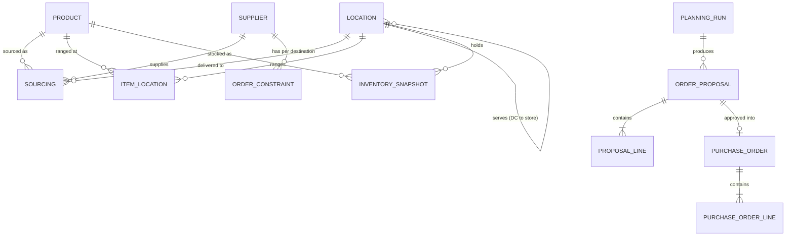
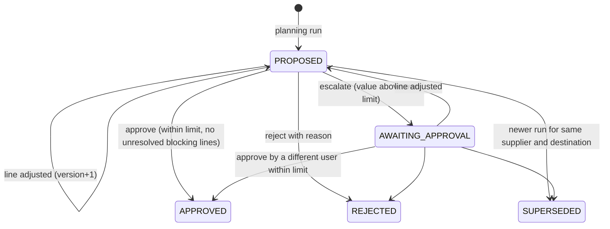
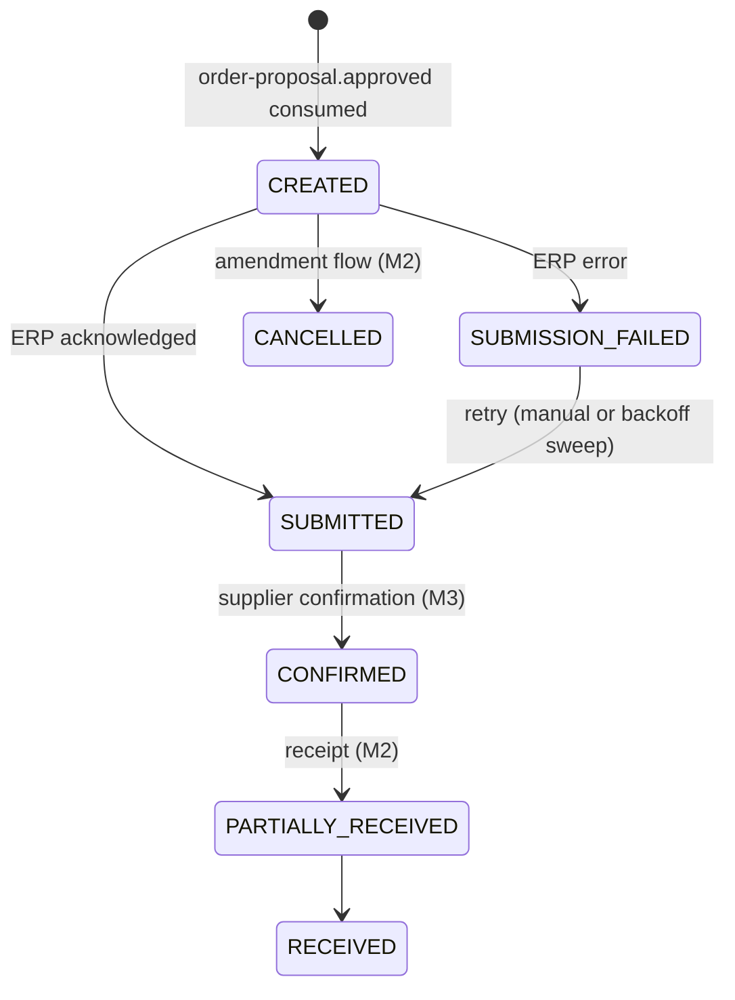

# E. Canonical entities, schemas, APIs and events

The contracts in `/contracts` are the source of truth. Code is tested against them:

| Contract | File | Checked by |
|---|---|---|
| Planner API (OpenAPI 3.1) | `contracts/openapi/replen-api.v1.yaml` | `apps/api/test/platform.spec.ts` validates live responses against the component schemas; `packages/contracts` generates the TypeScript types the web app compiles against |
| Domain events (CloudEvents + JSON Schema 2020-12) | `contracts/events/*.schema.json`, `index.json` | `OutboxService.emit` refuses to write an event that fails its schema; `flow.spec.ts` re-validates every published event |
| Engine request/response | `contracts/engine/plan-*.v1.schema.json` | Generated from the engine's pydantic models; `engine/tests/test_api_contracts.py` fails on drift; the API validates every request it sends and every response it receives |

Regenerate types after a contract change with `npm run contracts:generate`.

## Canonical entities



| Entity | Identity | Owner (schema) | Notes |
|---|---|---|---|
| Product | `sku` | reference | Attributes used for analogue matching: category, subcategory, brand, colour family, price. Lifecycle: status, launch date, end-of-life date |
| Location | `location_id` | reference | `STORE` or `DC`; stores carry `serving_dc_id`; DCs carry `fulfils_online` |
| Supplier | `supplier_id` | reference | Lead time mean and standard deviation, order weekdays, delivery weekdays (ISO 1-7) |
| Sourcing | `(sku, destination_location_id)` | reference | Supplier, unit cost, case pack, MOQ. One primary source per SKU-destination in the slice |
| Item-location | `(sku, location_id)` | reference | Service level target, capacity, replenishment source (supplier or DC transfer) |
| Order constraint | `(supplier_id, destination_location_id)` | reference | Minimum order value, budget |
| Inventory snapshot | `(sku, location_id)` | inventory | Latest physical buckets; history belongs in BigQuery |
| Legacy open order | `(po_reference, sku)` | inventory | Full-extract semantics: each import replaces the set |
| Planning run | `run_id` | planning | Frozen engine request (`input`), its SHA-256 (`input_hash`), engine and contract version, accuracy, timings |
| Order proposal | `proposal_id` | planning | Aggregate root. One per supplier, destination and order date. Optimistic concurrency via `version`. At most one open proposal per key (partial unique index) |
| Proposal line | `line_id` | planning | Recommended (immutable) and final (planner) quantity, override reason, calculation trace (`explanation`), chart snapshot, backtest accuracy |
| Purchase order | `po_id` | purchasing | `source_proposal_id` unique, so creation is idempotent. Status machine below. ERP number after acknowledgement |
| Audit event | `seq`, `event_id` | audit | Append-only (trigger), hash-chained (`prev_hash`, `hash`) |
| Outbox / inbox / idempotency key | | messaging | Delivery bookkeeping |

The DDL is in `apps/api/src/db/migrations.ts`. Money is `numeric(14,2)` (unit costs `numeric(12,4)`), quantities are integers, dates are `date`, instants are `timestamptz` in UTC.

## State machines





`CONFIRMED`, `PARTIALLY_RECEIVED`, `RECEIVED` and `CANCELLED` exist in the schema and on-order calculation but no transition into them is implemented in the slice.

## API summary

All routes are under `/api/v1` and require a bearer token, except `/health`, `/auth/dev-token` and `/users` (dev only).

| Method | Path | Roles | Purpose |
|---|---|---|---|
| POST | `/imports/{entity}` | admin | Batch upsert from the legacy ACL (9 entities) |
| GET | `/products`, `/locations`, `/suppliers` | any | Reference data; suppliers include OTIF |
| GET | `/inventory-positions` | any | Buckets, on-order (legacy + Replen), ATS, inventory position |
| POST | `/planning-runs` | planner roles, admin | Freeze inputs, call engine, persist proposals; `Idempotency-Key` |
| GET | `/planning-runs`, `/planning-runs/{id}` | any | Run status, accuracy, timings |
| GET | `/order-proposals`, `/order-proposals/{id}` | any | Exception-first queue; detail with lines, traces and approval check for the caller |
| PATCH | `/order-proposals/{id}/lines/{lineId}` | planner roles | Override with reason code; `expectedVersion` required |
| POST | `/order-proposals/{id}/approve`, `/escalate`, `/reject` | planner roles | Decisions; `expectedVersion`; `Idempotency-Key` |
| POST | `/order-proposals/{id}/simulate` | any | What-if on frozen inputs, not persisted |
| GET | `/purchase-orders`, `/purchase-orders/{id}` | any | PO status, ERP number, attempts |
| POST | `/purchase-orders/{id}/retry-submission` | planner roles, admin | Retry a failed ERP submission |
| GET | `/audit-events`, `/audit-events/verify` | any | Trail per entity; hash chain verification |
| GET | `/events` | any | Outbox with delivery status |
| GET | `/kpis` | any | KPI snapshot with definitions and sources |

Errors are RFC 9457 problem details with a stable `code` (for example `VERSION_CONFLICT`, `APPROVAL_LIMIT_EXCEEDED`, `FOUR_EYES`, `BLOCKING_EXCEPTIONS`, `INVALID_ADJUSTMENT`, `IDEMPOTENCY_KEY_REUSED`) and the request's `correlationId`.

## Events

Envelope (CloudEvents 1.0, structured JSON):

```json
{
  "specversion": "1.0",
  "id": "8f6e1c1e-...",
  "source": "replen-api/planning",
  "type": "replen.planning.order-proposal.approved.v1",
  "subject": "<proposalId>",
  "time": "2026-10-08T17:47:51.204Z",
  "datacontenttype": "application/json",
  "dataschema": "https://contracts.replen.local/events/planning.order-proposal.approved.v1.schema.json",
  "correlationid": "corr-approve-home",
  "causationid": null,
  "aggregateversion": 3,
  "tenantid": "synthetic-retailer",
  "data": { "proposalId": "...", "approvedBy": "planner.priya", "totalValue": 4243.6, "lines": [] }
}
```

| Type | Subject | Emitted when | Consumers in slice |
|---|---|---|---|
| `replen.reference.import.completed.v1` | batch id | Import committed | none (analytics archive) |
| `replen.planning.run.completed.v1` | run id | Proposals persisted | none |
| `replen.planning.order-proposal.created.v1` | proposal id | New proposal | none |
| `replen.planning.order-proposal.superseded.v1` | proposal id | Newer run replaced it | none |
| `replen.planning.order-proposal.line-adjusted.v1` | proposal id | Planner override | none |
| `replen.planning.order-proposal.escalated.v1` | proposal id | Sent for higher approval | none (notification in M2) |
| `replen.planning.order-proposal.approved.v1` | proposal id | Approved | purchasing: create PO |
| `replen.planning.order-proposal.rejected.v1` | proposal id | Rejected | none |
| `replen.purchasing.purchase-order.created.v1` | PO id | PO created | purchasing: submit to ERP |
| `replen.purchasing.purchase-order.submitted.v1` | PO id | ERP acknowledged | none (inventory reads on-order directly) |
| `replen.purchasing.purchase-order.submission-failed.v1` | PO id | ERP rejected or unreachable | none (alerting in M2) |

Rules: subject is the aggregate id and the Pub/Sub ordering key; `aggregateversion` increases strictly per subject; consumers record `(consumer, event id)` in the inbox inside their own transaction; `causationid` is the id of the event a handler was reacting to, `correlationid` is carried from the originating HTTP request.
