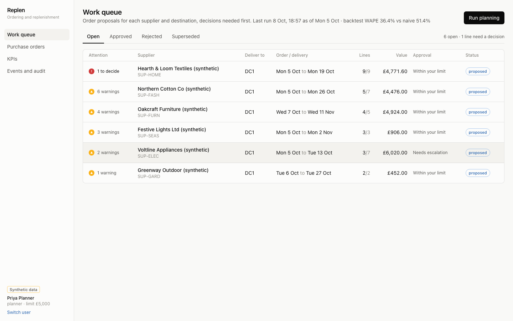
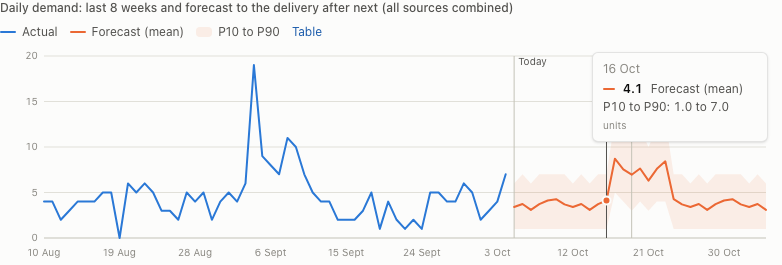
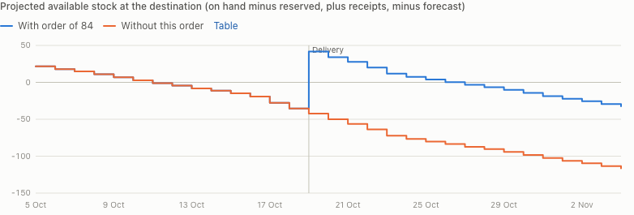
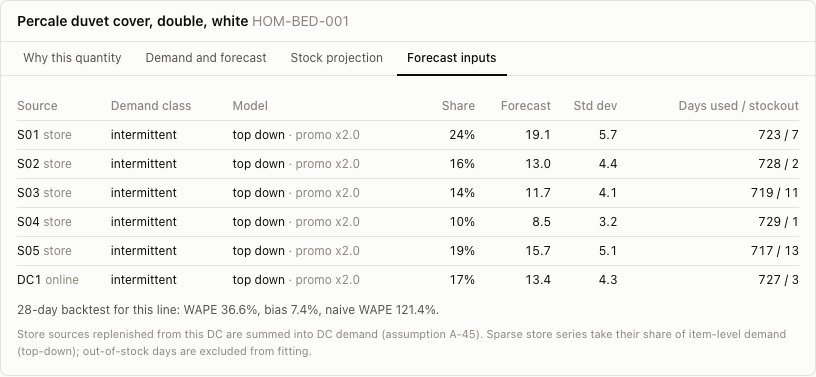
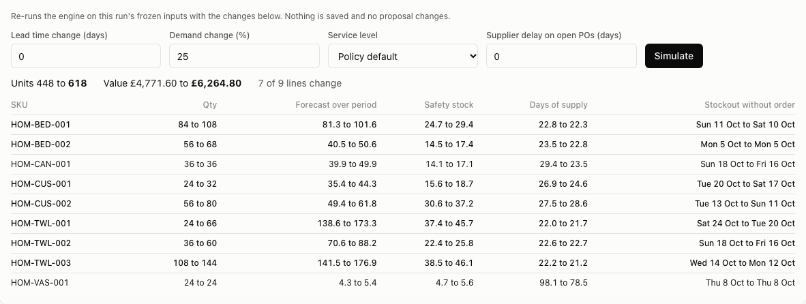
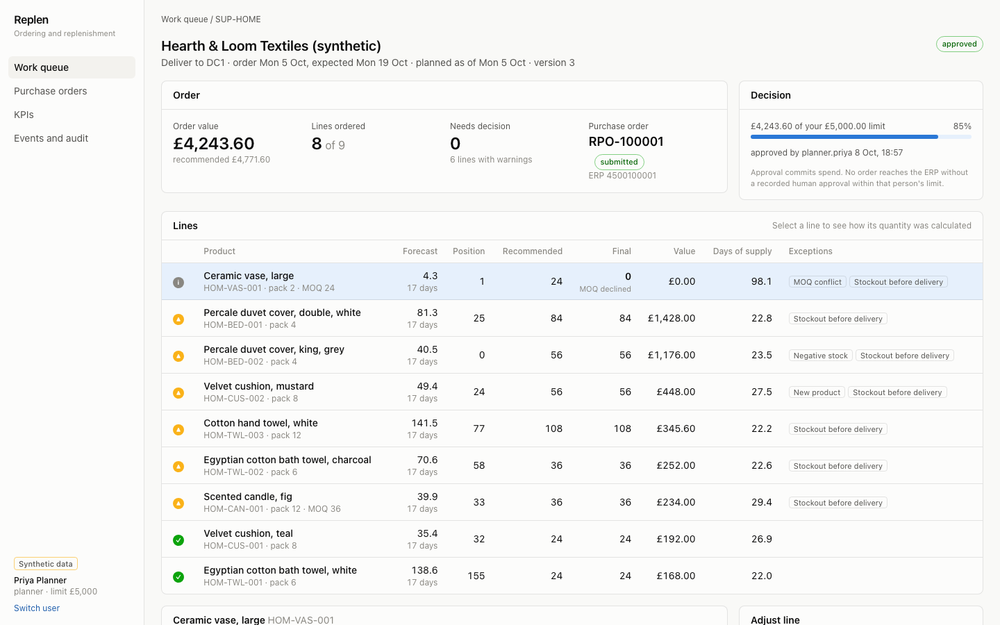
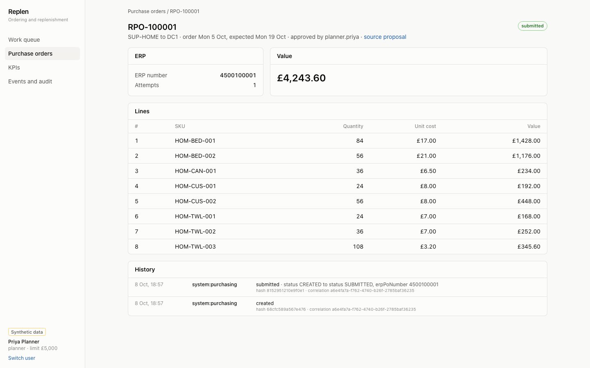
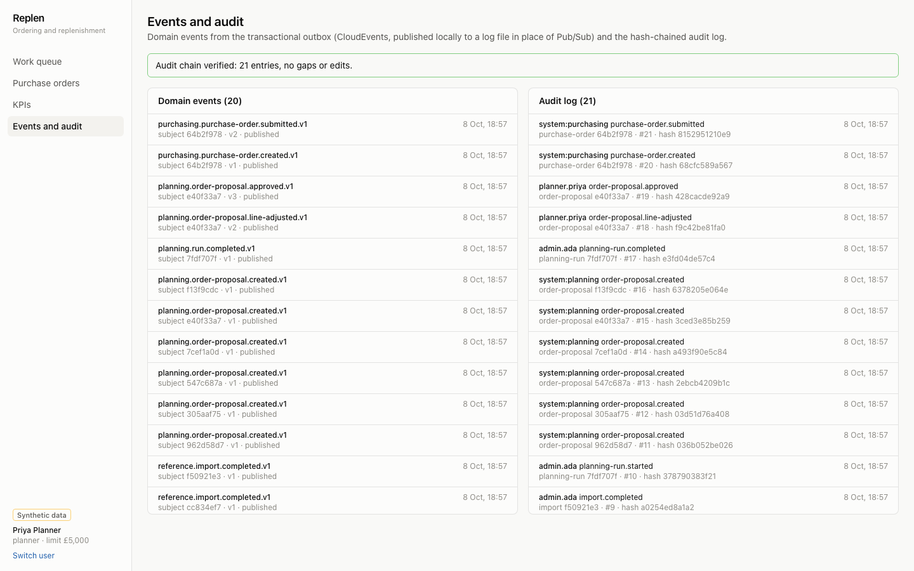
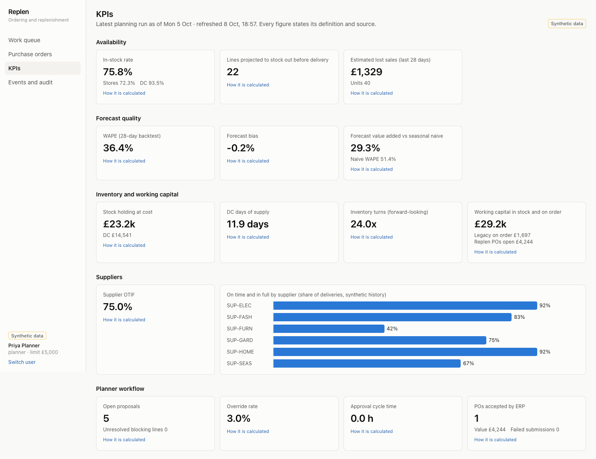

# G. Planner UX: workflows

The workbench is built around the planner's daily job: clear the decisions the engine cannot make, check the large or unusual orders, approve the rest within authority. Dashboards come last. Screens below are from the running slice on synthetic data (`docs/img/`).

## Design rules

- Exception-first. The queue sorts by unresolved blocking lines, then warnings, then value. A proposal with nothing unusual is one click from approval.
- Every quantity explains itself in the planner's terms: days of cover, forecast, safety stock, what is already on hand and on order, and each constraint with before and after values. No model jargon without the number it produced.
- The engine never decides alone where judgement is needed. MOQ conflicts and capacity-below-MOQ are blocking: approval is disabled until a planner picks an option.
- Overrides are cheap but never silent: one reason code, an optional note (required for "Other" and for very large changes), recorded with the user and time.
- Spend authority is visible before the click: the decision panel shows the order value against the user's limit and lists exactly why approval is unavailable.
- Status colour always comes with an icon and a label; series colours and status colours never swap roles; charts have a table view.

## Workflow 1: morning review of the work queue

1. The planner signs in (development sign-in lists synthetic users and their limits; production uses workforce identity).
2. The queue shows one proposal per supplier, destination and order date with: attention (lines needing a decision or warnings), value and recommended value if changed, lines ordered of total, whether the value is within the user's limit, and status.
3. A planner or admin can trigger a planning run; production runs nightly (A-63) and this button is for re-planning after a data correction.

## Workflow 2: resolve an MOQ conflict

1. Opening Hearth & Loom shows "Needs decision 1" and the decision panel explains that approval is blocked by one line.
2. The blocking line (ceramic vase) is pre-selected. "Why this quantity" reads as arithmetic: 4.3 units forecast over 17 days, plus 4.7 safety stock at 95%, gives an order-up-to level of 9; position is 1, so the need is 8; the MOQ of 24 would add 16 units covering 63 days, beyond the 28-day limit.
3. The planner chooses "Order the MOQ (24)" or "Skip this cycle (0)". Either records a reason code (`MOQ_ACCEPTED` / `MOQ_DECLINED`), resolves the line and bumps the proposal version.

## Workflow 3: check a line before trusting it

| Demand and forecast | Stock projection |
|---|---|
|  |  |

- Demand and forecast: eight weeks of actual demand across all sources, the forecast to the delivery after next with a P10 to P90 band, and markers for today and delivery. Days when most sources were out of stock are drawn as hollow markers, because their low sales are not real demand. Hovering shows every series for that day; "Table" shows the numbers.
- Stock projection: available stock with and without this order, as steps by day, with the delivery date marked. The "with order" line uses the planner's final quantity, so an override is visible immediately.
- Forecast inputs: each source's demand class, model, share of item demand, promo uplift, yearly seasonality, days used and days excluded as stockouts, the analogues for new products, and this line's backtest accuracy.

## Workflow 4: override a quantity

1. In "Adjust line", the planner steps the final quantity in case packs, picks a reason and saves.
2. The API rejects invalid input with a specific message ("must be a multiple of the case pack 6 (nearest: 24 or 30)", "must be 0 or at least the MOQ 36"); nothing changes until it is valid.
3. If someone else changed the proposal meanwhile, the save fails with a version conflict and the planner reloads; there is no last-write-wins.
4. Editing an escalated proposal sends it back to "proposed", so an approver never approves something different from what they reviewed.

## Workflow 5: what-if

The planner asks "what if demand is 25% higher", "what if the supplier is a week late", or "what if we target 99%". The engine re-runs on the planning run's frozen inputs and returns baseline against scenario for every line: quantity, forecast, safety stock, days of supply and stockout date, with order totals. Nothing is saved. This is the same code path as the live plan, so the comparison is like for like.

## Workflow 6: approve within authority, or escalate

1. Within limit and with no unresolved blocking lines, "Approve and create PO" is enabled. Approval is idempotent (the browser sends an `Idempotency-Key`), so a double click cannot create two orders.
2. Above the limit (Voltline at GBP 6,020 against GBP 5,000), approval is disabled with the reason, and "Request approval" escalates. The escalating planner cannot then approve it; a senior planner with a higher limit can.
3. After approval the purchase order appears within a second or two: created from the approval event, submitted through the ERP adapter, with the ERP number shown.

## Workflow 7: follow the order and the evidence

- The purchase order page shows status, ERP number, attempts and the last error. Failed submissions can be retried; automatic retries back off on transient errors.
- Each proposal and PO has a history tab drawn from the hash-chained audit log: who did what, before and after values, correlation id.
- "Events and audit" lists every domain event with delivery status and shows whether the audit chain verifies.

## KPIs

KPIs are stat tiles grouped by availability, forecast quality, inventory and working capital, suppliers and planner workflow. Each tile states its definition and source on request; supplier OTIF is the one comparison that needs a chart. All values are computed from synthetic data and say so.

## Not yet designed in the slice

- Bulk actions (approve all clean proposals for a category) with a policy guard, and standing approval rules for low-risk orders (M2). Rules would be created and owned by a named human and audited, satisfying the "no unapproved autonomous commitments" constraint.
- The read-only assistant (M2): answers "why did we run out of X" or "why is this order so large" from stored traces, KPIs and events, with citations to the trace steps it used; it has no write tools.
- Supplier portal views (M3), store-level transfer review (M3), allocation and markdown screens (M4).
- Accessibility audit with assistive technology users; keyboard navigation exists for tables, tabs and charts but has not been tested with screen readers.
