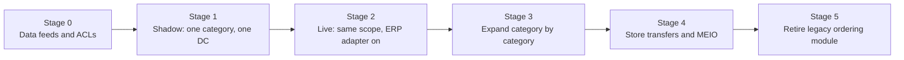

# I. Incremental migration and coexistence

No big-bang replacement. Replen takes over ordering one category and one destination at a time, and the legacy system keeps ordering everything else until each slice passes the same gates. At every stage there is a single owner for each SKU-destination's ordering, recorded in data, and a rollback that takes effect within one planning cycle.

## Principles

- One writer per decision. An `ordering_owner` flag per SKU-destination (LEGACY or REPLEN) decides which system may send POs. Replen's ERP adapter refuses lines it does not own; the legacy job is configured to skip lines Replen owns.
- Read from legacy through anti-corruption layers; never write into legacy databases. Replen's only write path into the estate is the ERP purchase-order API (A-23).
- Legacy remains the system of record for master data, stock and finance throughout. Replen holds replicas and derived positions.
- Shadow before live. Every new scope runs in shadow mode first: proposals are generated and reviewed but not sent.
- Same gates for every scope; promotion is a data change, not a deployment.

## Stages

| Stage | What changes | Exit gate |
|---|---|---|
| 0 Data feeds | ACLs for products, sourcing, stock, open POs, sales history into GCP (A-20 to A-26); reconciliation reports against legacy totals | 4 weeks of daily feeds reconciling to legacy within agreed tolerances |
| 1 Shadow | Nightly runs for one category and one DC; planners review in the workbench; nothing reaches the ERP. Daily comparison: Replen proposal versus legacy order, forecast accuracy versus legacy, simulated outcome of each | 8 weeks; Replen WAPE and bias at least as good as legacy; inventory replay shows equal or better service at equal or lower stock; planners accept traces |
| 2 Live | `ordering_owner = REPLEN` for the scope; ERP adapter enabled for those suppliers; legacy skips them | 4 weeks with zero unreconciled POs between Replen and ERP; rollback rehearsed |
| 3 Expand | Repeat stages 1 and 2 per category, starting with replenished basics (towels, small electricals), leaving fashion one-shot buys and furniture until allocation (M4) exists | Same gates per category |
| 4 Network | Store replenishment from DCs as transfer orders, then multi-echelon targets | Store availability at or above legacy for pilot stores |
| 5 Retire | Legacy ordering module switched off once all scopes are owned by Replen for one full season | Finance sign-off; audit confirms no legacy-originated POs for the season |

## Coexistence mechanics

- On-order is unified: legacy open POs arrive through the open-order extract (full-extract semantics), Replen POs are read directly, so neither system double-orders the other's stock. The slice implements this (`inventory.openOrders`).
- Reference data has one source: the legacy merchandising system. Replen-specific parameters (service levels, capacity overrides, approval limits) live in Replen and are exported for reporting.
- Identifiers: Replen PO numbers (`RPO-...`) are distinct from legacy numbers; the ERP number is stored on both sides via the client reference.
- Reconciliation job (M2): daily comparison of Replen POs with ERP PO state; any mismatch raises an exception for the planner and an alert for the platform team.

## Rollback

Set `ordering_owner = LEGACY` for the scope. The next legacy run orders those lines; Replen proposals for the scope are suppressed; open Replen POs stay valid in the ERP and continue to count as on-order in both systems. Rollback is rehearsed in stage 2 before the gate passes.

## Risks

| Risk | Mitigation |
|---|---|
| Both systems order the same line during cut-over | Single `ordering_owner` flag checked in the ERP adapter and in the legacy job; reconciliation report on day one |
| Legacy extracts change without notice | ACL schema validation rejects the batch and alerts; previous day's data remains in use (degraded mode, doc 04) |
| Planners distrust new recommendations | Shadow stage with side-by-side comparison and full traces; override reasons feed model improvement |
| Seasonal ranges cut over mid-season | Cut over replenished basics first; seasonal and fashion only at season boundaries |
